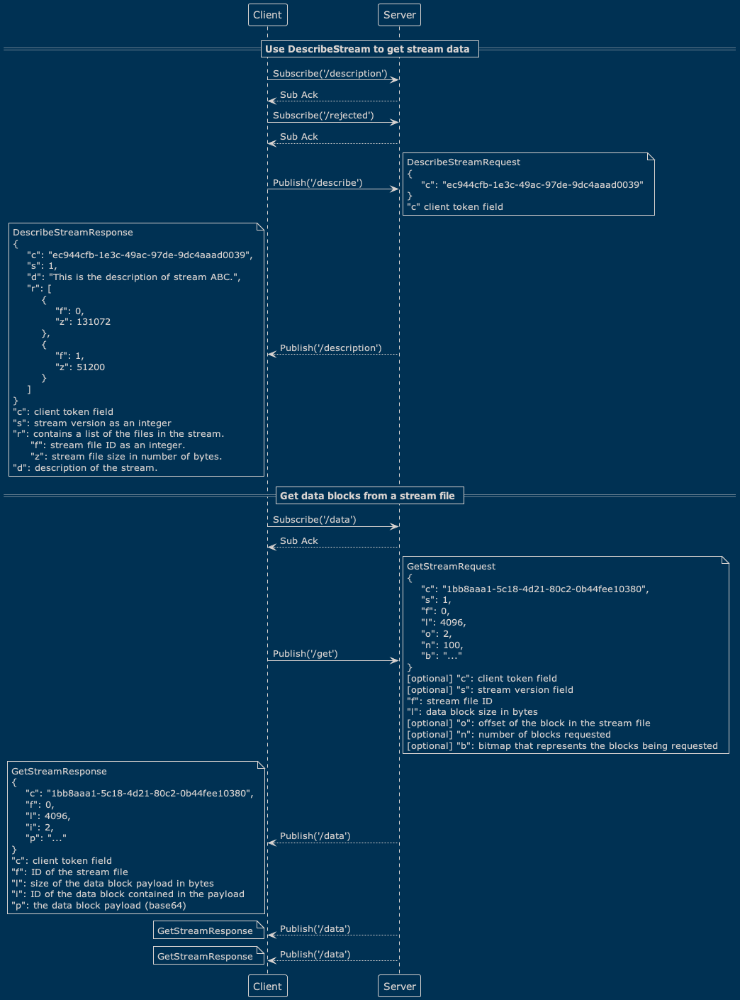
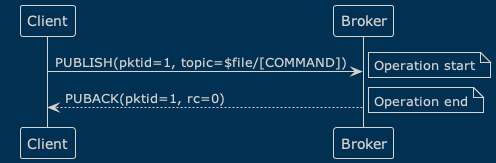
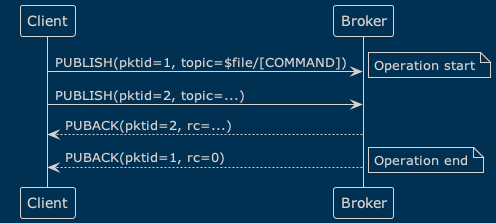
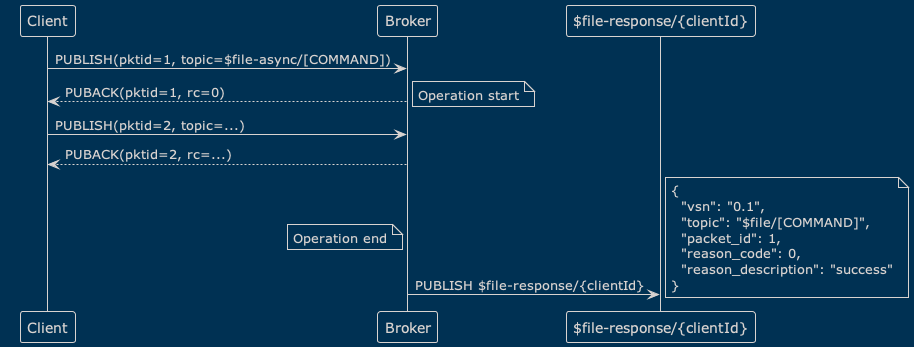
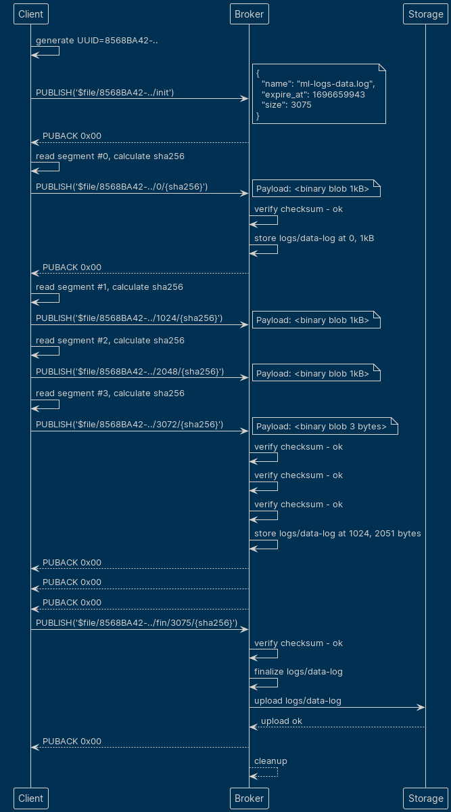
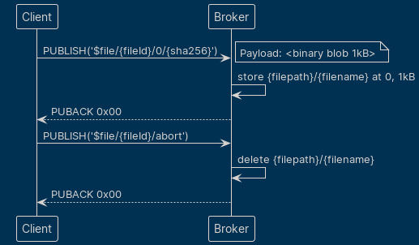
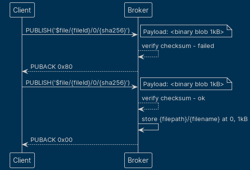

This document defines protocol to send files from MQTT clients to MQTT server.

## Terminology

The keywords "MUST", "MUST NOT", "REQUIRED", "SHALL", "SHALL NOT", "SHOULD", "SHOULD NOT", "RECOMMENDED", "NOT RECOMMENDED", "MAY", and "OPTIONAL" in this document are to be interpreted as described in [BCP 14](https://www.rfc-editor.org/bcp/bcp14) [[RFC2119](https://www.rfc-editor.org/rfc/rfc2119)] [[RFC8174](https://www.rfc-editor.org/rfc/rfc8174)] when, and only when, they appear in all capitals, as shown here.

The following terms are used as described in [MQTT Version 5.0 Specification](https://docs.oasis-open.org/mqtt/mqtt/v5.0/os/mqtt-v5.0-os.html):
* Application Message
* Server
* Client
* Topic
* Topic Name
* Topic Filter
* MQTT Control Packet

*At least once*: a message can be delivered many times, but cannot be lost

## Requirements

* The protocol MUST use only PUBLISH type of MQTT Control Packet
* The protocol MUST support transfer of file segments
* Server MUST be able to verify integrity of each file segment and of the whole file
* Client MAY know total file size when initiating the transfer
* Client MAY abort file transfer
* Server MAY ask the client to pause file transfer
* Server MAY ask the client to abort file transfer
* The protocol MUST guarantee "At least once" delivery
* Server MUST NOT support subscription on topics dedicated for file transfer

## AWS IoT MQTT-based file delivery (reference design)

As an example of existing implementation we can look at AWS IoT Core [which provides functionality](https://docs.aws.amazon.com/iot/latest/developerguide/mqtt-based-file-delivery.html) to [deliver files to IoT devices](https://docs.aws.amazon.com/iot/latest/developerguide/mqtt-based-file-delivery-in-devices.html):



## Design

### Overview

* Files are split in segments, segments can be of arbitrary length
* Client SHOULD generate unique identifier for each file being transferred and use it as `fileId` in Topic Name (UUID according to [RFC 4122](https://www.rfc-editor.org/rfc/rfc4122) is recommended)
* Client SHOULD consider `fileId` as a unique identifier for the file transfer, and MUST NOT reuse it for other file transfers
* Broker SHOULD consider `clientId` + `fileId` pair as a Broker-wide unique identifier for the file transfer
* Client MAY calculate SHA-256 checksum of the segment it's about to send and send it as part of Topic Name
* Client MAY calculate SHA-256 checksum of the file it's about to send and include it in the `init` message payload or send is as part of the `fin` message
* If Client chooses to provide checksum for file segments, whole file, or both, it MUST use [SHA-256](https://www.rfc-editor.org/rfc/rfc6234)
* If checksum is included in the `init` message payload, the Broker MUST use it to verify integrity of the file after receiving the `fin` message for the corresponding file transfer
* If checksum is included in topic name, Broker MUST use it to verify integrity of corresponding data:
  * segment, if it's a segment transfer message
  * whole file, if it's a `fin` message
* If checksum verification fails, Broker MUST reject the corresponding data
* Client MUST use Topic starting with `$file/`(`$file-async/`) to transfer files.
* Broker MUST NOT let clients subscribe to Topics starting with `$file/`(`$file-async/`) topics
* Segment length can be calculated on the server side by subtracting the length of the [Variable Header](https://docs.oasis-open.org/mqtt/mqtt/v5.0/os/mqtt-v5.0-os.html#_Toc3901025) from the [Remaining Length](https://docs.oasis-open.org/mqtt/mqtt/v5.0/os/mqtt-v5.0-os.html#_Toc3901105) field that is in the [Fixed Header](https://docs.oasis-open.org/mqtt/mqtt/v5.0/os/mqtt-v5.0-os.html#_Toc3901021)

### Protocol flow

Data is transferred in PUBLISH packets in the following order:

1. `$file[-async]/{fileId}/init`

    ```
    {
      "name": "ml-logs-data.log",
      "size": 12345,
      "checksum": "1234567890abcdef1234567890abcdef1234567890abcdef1234567890abcdef",
      "expire_at": 1696659943,
      "segments_ttl": 600
    }
    ```

2. `$file[-async]/{fileId}/{offset}[/{checksum}]`

    ```
    <file segment data>
    ```

3. `$file[-async]/{fileId}/{offset}[/{checksum}]`

    ```
    <file segment data>
    ```

4. ...

5. `$file[-async]/{fileId}/[fin/{fileSize}[/{checksum}] | abort]`

    No payload


### Sync mode vs Async mode

File transfer individual commands may be handled in two modes: synchronous and asynchronous. The mode is chosen by the client, by sending commands either to `$file/...` (sync mode) or `$file-async/...` (async mode) topics.

Client is free to mix arbitrarily sync and async commands in the same file transfer session.

#### Synchronous mode

In synchronous mode, the successful/unsuccessful status of individual operations is communicated to the client via Reason Code field of MQTT `PUBACK` messages. See [Reason codes](#reason-codes) for details.



Caveats:

* Some operations (`fin` command) may take considerable time to complete. So if a client wants to utilize the session while waiting for the result, it should either use async mode or implement some kind of asynchronous logic itself, that is to deal with several unacked PUBLISH messages in parallel, like this:


* MQTTv3 clients do not support reason codes, so async mode is the preferred option for them.

#### Asynchronous mode

In asynchronous mode, the logic of command handling is the following:
* Client sends a command to `$file-async/...` topic.
* Broker responds with `PUBACK`. Nonzero Reason Code indicates immediate failure.
* Zero Reason Code indicates that the command has been accepted for processing. The client is expected to wait for the actual result of the command via `$file-response/{clientId}` topic.



The result of the command is a JSON document with the following fields:
```json
{
  "vsn": "0.1",
  "topic": "$file-async/[COMMAND]",
  "packet_id": 1,
  "reason_code": 0,
  "reason_description": "success"
}
```

| Field | Description |
|-------|-------------|
| `vsn`  | response document format version |
| `topic`  | the topic of the command that the response is for, e.g. `$file-async/somefileid/init` |
| `packet_id`  | the MQTT packet id of the command packet (`PUBLISH`) that the response is for |
| `reason_code`  | the result code of the command execution. See [Reason Codes](#reason-codes) for details |
| `reason_description`  | the human-readable description of the Reason Code |

JSON Schema is available [here](schema/response.json).

Notes:
* The operation result is always sent to the response topic (both in case of immediate failure and in case of actual processing). So the response topic may be used as the only source of information about the operation result. Also, this is the only variant available for MQTTv3 clients.
* The response topic is client-specific. The client should subscribe to it before sending the command.
* The client may override the response topic using `REQUEST/RESPONSE` .

#### Reason Codes

In the subsequent sections, the _reason code_ of a file transfer operation means the _final_ reason code of the command execution, that is, the Reason Code of `PUBACK` packet in the sync mode or the `reason_code` response document field value in the async mode.

### Protocol messages

#### `$file[-async]/{fileId}/init` message

Initialize the file transfer. Server is expected to store metadata from the payload in the session along with `{fileId}` as a reference for the rest of file transfer.

  * Qos=1
  * Payload Format Indicator=0x01
  * `{fileId}` is corresponding file UUID
  * Payload is a JSON document

Getting a successful reason code from the broker means that the file transfer has been initialized successfully, and the metadata has been persisted in the storage.

Broker MAY refuse to accept the file transfer in case of the metadata conflict, e.g. if the transfer with the same `{fileId}` from the same Client has different `name` or `checksum` value. Client is expected to start the transfer with a different `{fileId}`.

Broker MAY abort incomplete file transfers after their respective sessions have been discarded, and clean up any resources associated with them.

Broker MAY refuse the file transfer if the `fileId` is too long, but generally `fileId`s of up to 255 bytes (in UTF-8 encoding) should be safe to use.

##### `init` payload JSON Schema

Available [here](schema/init.json).

* Broker MAY use `name` value as a filename in a file system

    This generally means that it SHOULD NOT contain path separators, and SHOULD NOT contain characters or sequences
    of characters that are not allowed in filenames in the file system where the file is going to be stored. Also,
    the filename SHOULD be limited to 255 bytes (in UTF-8 encoding).

* Broker SHOULD consider `size` value as informational only, given it's not required to be provided by the client

    Mandatory file size should be specified in the `fin` message Topic anyway, and may be different from the value
    provided in the `size` field. The `size` field may be used for example to calculate the progress of the transfer,
    which thus may be inaccurate.

* Broker SHOULD have default setting for `segments_ttl`

* Broker MAY delete segments of unfinished file transfers when their TTL has expired

* Broker MAY NOT honor `segments_ttl` value that is either too large or too small

    What means _too large_ or _too small_ is up to the Broker implementation and/or configuration.

#### `$file[-async]/{fileId}/{offset}[/{checksum}]` message

One such message for each file segment.

  * Qos=1
  * Payload Format Indicator=0x00
  * Payload is file segment bytes
  * `{offset}` is byte offset of the given segment
  * optional `{checksum}` is SHA-256 checksum of the file segment

Getting a successful reason code from the Broker means that the file segment has been verified (if checksum was provided) and successfully persisted in the storage.

#### `$file/{fileId}/fin/{fileSize}[/{checksum}]` message

All file segments have been successfully transferred.

  * Qos=1
  * no payload
  * optional `{checksum}` is SHA-256 checksum of the file

Getting a successful reason code from the Broker means that the file being transferred is ready to be used. This implies a lot of things:
  * Broker has verified that it has corresponding metadata for the file
  * Broker has verified that it has all the segments of the file up to `{fileSize}` persisted in the storage
  * Broker has verified the file integrity (if checksum was provided)
  * Broker has published the file along with its metadata to the location where it can be accessed by other users

In cases when checksum was provided both in the `init` message and in the `fin` message, Broker MUST ignore the former and use the latter.

Clients MUST expect that handling of the `fin` message may take considerable time, depending on the file size and the
Broker implementation or configuration.

#### `$file/{fileId}/abort` message

Client wants to abort the transfer.

  * Qos=1
  * no payload

### Durability

This specification does not define how reliably the file transfer data SHOULD be persisted. It is up to the Broker implementation what specific durability guarantees it provides (e.g. datasync or replication factor). However, Broker is expected to support transfers that are interrupted by a network failure, Broker restart, or Client reconnect.

### Reason codes

| Reason code | MQTT Name                     | Meaning in file transfer context                    |
|-------------|-------------------------------|-----------------------------------------------------|
| OMIT        |                               | Same as 0x00                                        |
| 0x00        | Success                       | File segment has been successfully persisted        |
| 0x10        | No matching subscribers       | Server asks Client to retransmit all segments       |
| 0x80        | Unspecified error             | For segment transmission, Server asks Client to retransmit the segment. For `fin`, Server asks Client to retransmit all segments |
| 0x83        | Implementation specific error | Server asks Client to cancel the transfer           |
| 0x97        | Quota exceeded                | Server asks Client to pause the transfer            |

#### 0x97, "Quota exceeded", "Pause Transfer"

Client is expected to wait before trying to retransmit file segment again.

### PUBACK from MQTT servers < v5.0

`PUBACK` messages prior to MQTT v5.0 do not carry Reason Code, so the only way for the client to know the result of the operation is to use async mode and wait for the response on the response topic.

### Happy path



### Transfer abort initiated by client



### Transfer restart initiated by server



